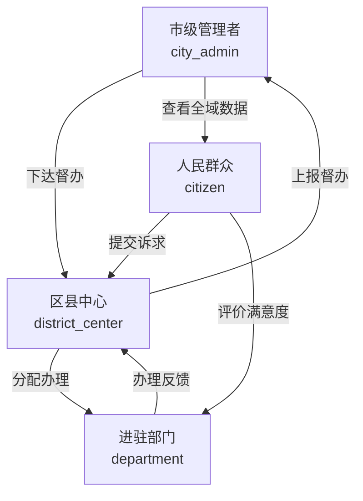
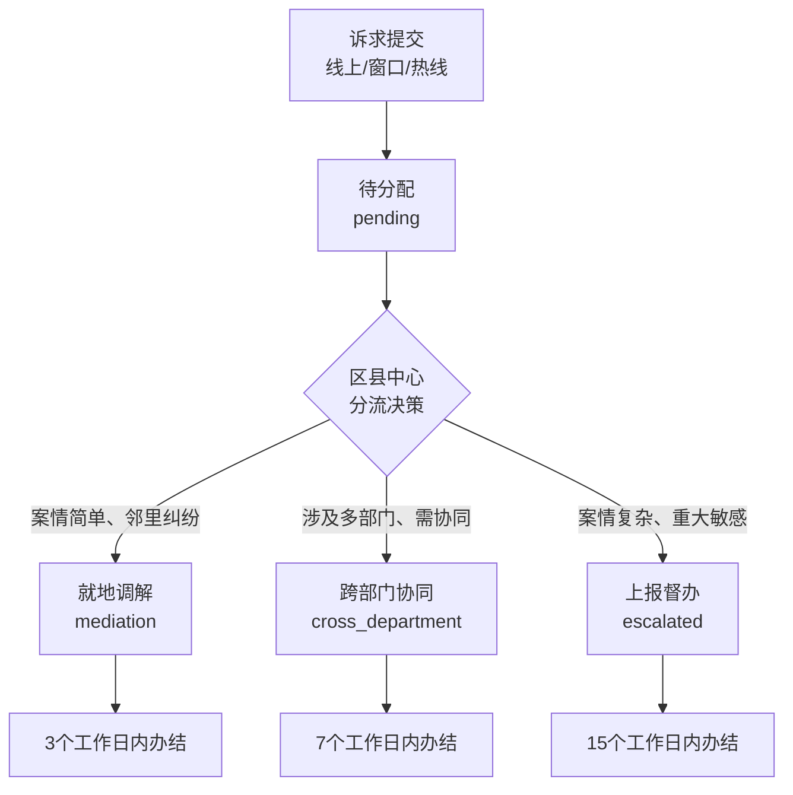
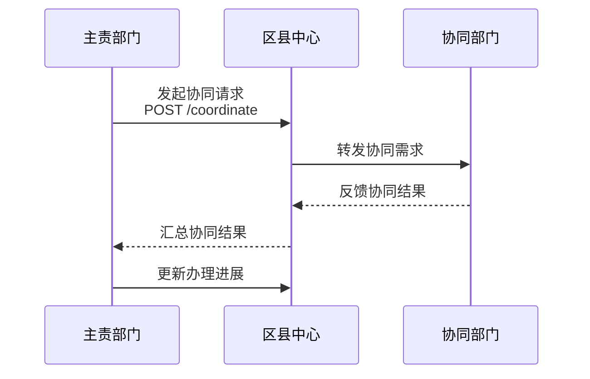
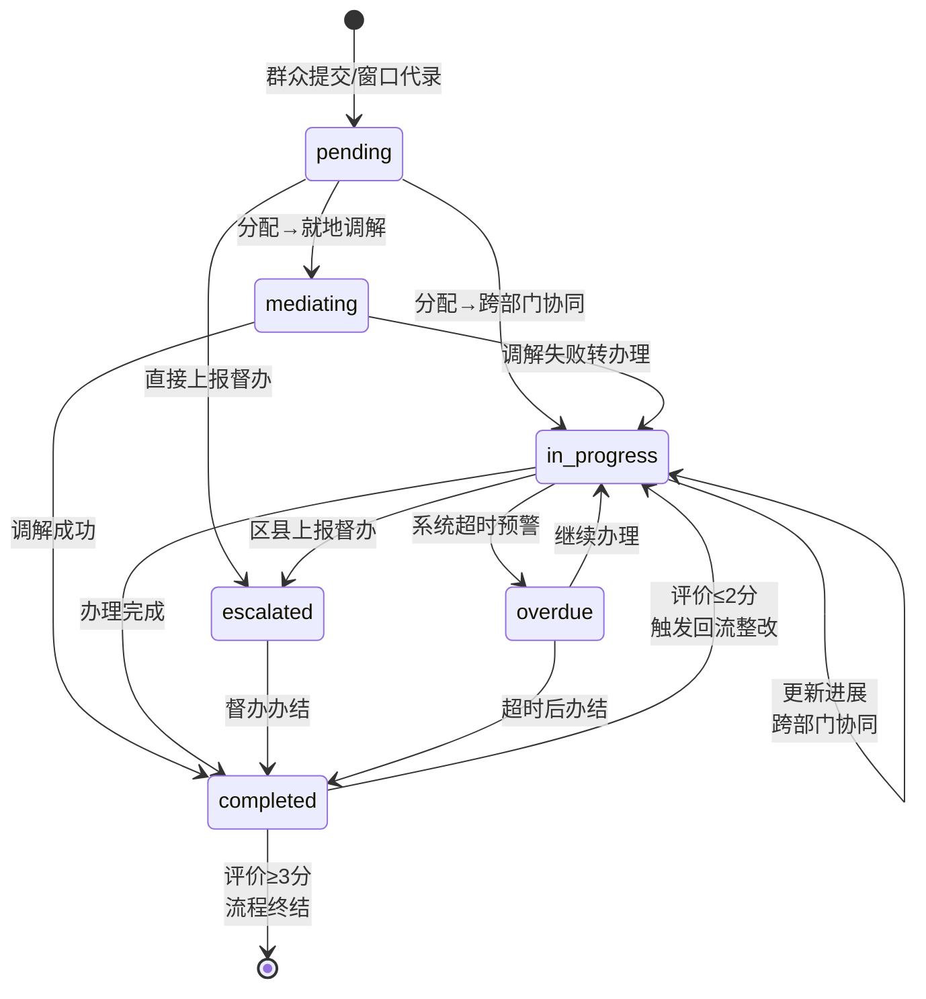
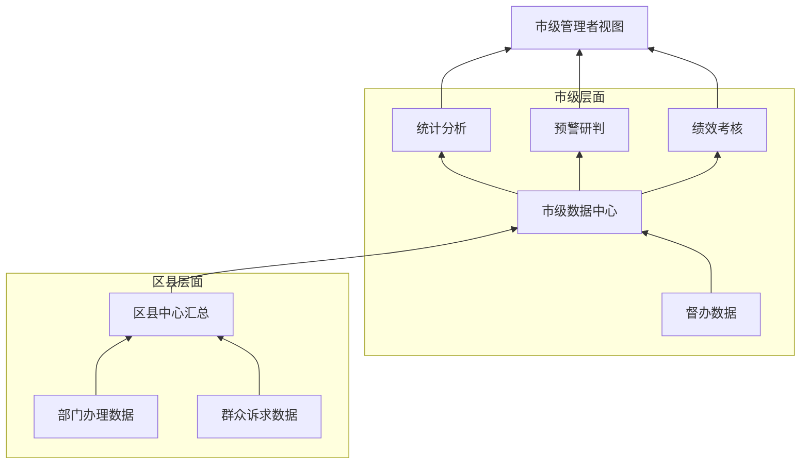
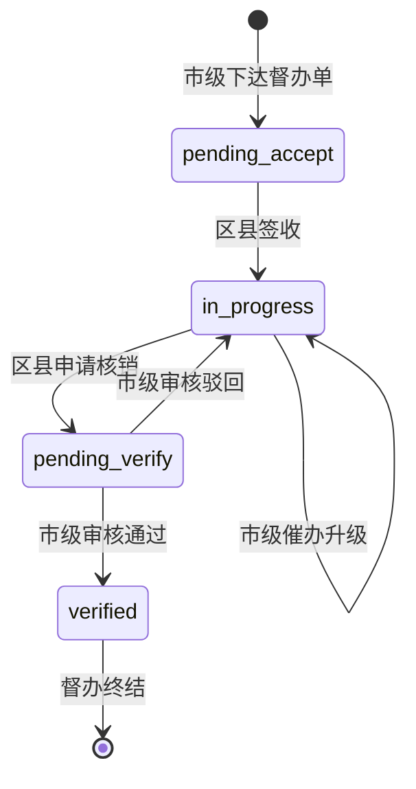
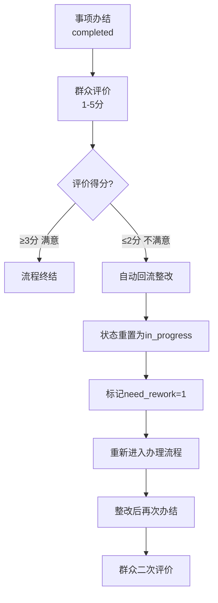
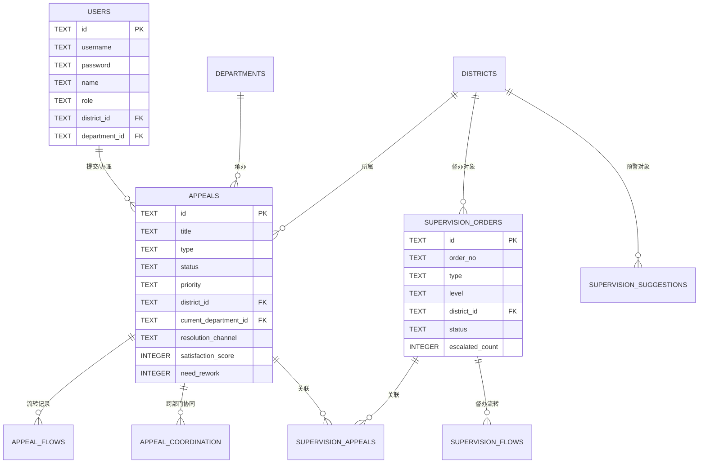
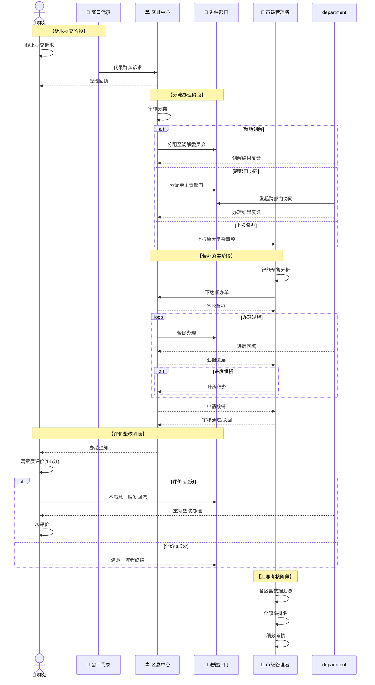

# 鸡西市市域社会治理综合平台 - 架构设计文档

## 一、系统概述

本平台是一个**多角色、市县两级、多渠道分流**的市域社会治理综合平台，实现了群众诉求从提交、分流、办理、督办到满意度评价的全流程闭环管理。

### 1.1 核心设计理念

```
「一级抓一级、层层抓落实」
    ↓
市级抓督办 → 区县抓落实 → 部门抓办理 → 群众评满意
```

### 1.2 技术栈

| 层级 | 技术栈 | 说明 |
|------|--------|------|
| 前端 | React 18 + Vite + Ant Design + ECharts | 多角色自适应视图 |
| 后端 | Node.js + Express + JWT | RESTful API |
| 数据库 | SQLite (better-sqlite3) | WAL模式，高性能 |
| 认证 | JWT + bcryptjs | 24小时token有效期 |

---

## 二、多角色体系与权限隔离

### 2.1 四种角色定义



| 角色 | 标识 | 数据范围 | 核心权限 |
|------|------|----------|----------|
| 👑 市级管理者 | `city_admin` | **全域9个区县**所有数据 | 督办管理、统计分析、核销审核 |
| 🏛️ 区县中心 | `district_center` | **本区县**所有诉求 | 诉求分配、协同调度、上报督办、督办办理 |
| 🏢 进驻部门 | `department` | **本部门**承办的诉求 | 办理反馈、跨部门协同、进展回填 |
| 👤 人民群众 | `citizen` | **本人**提交的诉求 | 提交诉求、查看进度、满意度评价 |

### 2.2 权限隔离机制（后端实现）

#### 数据行级过滤 - `appeals.js:57-133`

```javascript
// 根据角色自动追加数据过滤条件
if (user.role === "district_center") {
  sql += " AND a.district_id = ?";          // 只看本区县
} else if (user.role === "department") {
  sql += " AND a.current_department_id = ?"; // 只看本部门
} else if (user.role === "citizen") {
  sql += " AND (a.submitter_id = ? OR a.submitter_phone = ?)"; // 只看本人
}
```

#### 路由级权限控制 - `auth.js:26-40`

```javascript
// 角色装饰器模式，灵活控制接口访问
exports.appealRoutes.put("/:id/assign", 
  requireRole("district_center", "city_admin"),  // 仅这两种角色可分配
  function(req, res) { ... }
);
```

#### 接口权限矩阵

| 接口 | 市级 | 区县中心 | 进驻部门 | 群众 |
|------|------|----------|----------|------|
| GET /appeals | ✅ 全域 | ✅ 本区县 | ✅ 本部门 | ✅ 本人 |
| POST /appeals | ✅ | ✅ | ❌ | ✅ |
| PUT /assign | ✅ | ✅ | ❌ | ❌ |
| PUT /progress | ✅ | ✅ | ✅ | ❌ |
| PUT /complete | ✅ | ✅ | ✅ | ❌ |
| PUT /rate | ❌ | ❌ | ❌ | ✅ |
| POST /coordinate | ❌ | ✅ | ✅ | ❌ |
| PUT /transfer | ✅ | ✅ | ❌ | ❌ |

---

## 三、诉求分流机制 - 三条化解渠道

### 3.1 分流决策树



### 3.2 分流规则详解 - `appeals.js:235-307`

| 化解渠道 | 适用场景 | 办理时限 | 状态流转 | 核心部门 |
|----------|----------|----------|----------|----------|
| 🤝 **就地调解** | 邻里纠纷、婚姻家庭、小额消费等简单民事纠纷 | **3天** | `pending` → `mediating` → `completed` | 人民调解委员会 |
| 🔄 **跨部门协同** | 物业管理、劳动社保、基础设施等需多部门联动 | **7天** | `pending` → `in_progress` → `completed` | 主责部门 + 协同部门 |
| ⬆️ **上报督办** | 群体性事件、重大敏感、超时未办结 | **15天** | `pending` → `in_progress` → `escalated` | 市级督办 + 区县落实 |

#### 分流核心代码

```javascript
// 根据渠道自动设置办理时限和状态
var days = resolution_channel === "mediation" ? 3 :
           resolution_channel === "cross_department" ? 7 : 15;

var newStatus = resolution_channel === "mediation" ? "mediating" : "in_progress";
```

### 3.3 跨部门协同机制 - `appeals.js:475-522`



---

## 四、诉求状态流转全生命周期

### 4.1 状态机全景图



### 4.2 状态流转规则表

| 当前状态 | 可流转至 | 触发动作 | 执行角色 |
|----------|----------|----------|----------|
| `pending` | `mediating` | 分配调解 | 区县中心/市级 |
| `pending` | `in_progress` | 分配办理 | 区县中心/市级 |
| `pending` | `escalated` | 直接上报 | 区县中心/市级 |
| `mediating` | `in_progress` | 调解失败 | 调解部门 |
| `mediating` | `completed` | 调解成功 | 调解部门 |
| `in_progress` | `in_progress` | 更新进展 | 办理部门/区县中心 |
| `in_progress` | `escalated` | 上报督办 | 区县中心/市级 |
| `in_progress` | `completed` | 办结 | 办理部门/区县中心 |
| `in_progress` | `overdue` | 超时预警 | 系统自动 |
| `escalated` | `completed` | 督办办结 | 市级/区县中心 |
| `completed` | `in_progress` | 回流整改 | 系统自动（评价≤2分） |
| `overdue` | `in_progress` | 继续办理 | 办理部门 |
| `overdue` | `completed` | 超时办结 | 办理部门 |

### 4.3 关键动作与流水记录 - `appeal_flows` 表

每一次状态变更都会在 `appeal_flows` 表中留痕，形成完整的**操作审计链**：

| 动作类型 | 说明 | 示例 |
|----------|------|------|
| `create` | 诉求提交 | "诉求已提交" |
| `assign` | 分配处理 | "已分配至住建局，化解渠道：跨部门协同" |
| `progress` | 更新进展 | "已联系施工方，预计3天内修复" |
| `coordinate` | 跨部门协同 | "已发起协同至自然资源局" |
| `escalate` | 上报督办 | "案情复杂，已上报市级督办" |
| `complete` | 事项办结 | "事项已办结，道路已修复" |
| `rate` | 满意度评价 | "满意度评价：5分 - 非常满意" |
| `rework` | 回流整改 | "评价不满意，已触发回流整改" |
| `warn_overdue` | 超时预警 | "⚠️ 办理已超时，请注意！" |

---

## 五、市县两级数据流转与督办体系

### 5.1 数据自下而上汇总机制



### 5.2 市级统计汇总 - `stats.js:119-129`

市级可通过 `/stats/by-district` 接口获取各区县全景数据：

```javascript
SELECT
  d.id, d.name,
  COUNT(a.id) as total,                   -- 诉求总量
  SUM(CASE WHEN a.status = 'completed' 
           THEN 1 ELSE 0 END) as completed, -- 已办结
  SUM(CASE WHEN a.status IN ('pending',...) 
           THEN 1 ELSE 0 END) as active,   -- 办理中
  SUM(CASE WHEN a.status = 'overdue' 
           THEN 1 ELSE 0 END) as overdue,  -- 已超时
  AVG(CASE WHEN a.status = 'completed' 
           THEN JULIANDAY(a.actual_completed_at) 
                - JULIANDAY(a.created_at) 
           END) as avg_days,               -- 平均办理时长
  AVG(a.satisfaction_score) as avg_satisfaction -- 平均满意度
FROM districts d
LEFT JOIN appeals a ON d.id = a.district_id
GROUP BY d.id, d.name
```

### 5.3 智能预警体系 - `supervision_suggestions`

系统自动扫描各区县数据，触发三类预警：

| 预警类型 | 触发阈值 | 严重程度 |
|----------|----------|----------|
| ⏰ **超时预警** | 超时事项 ≥ 3件 | 3-4件=较重，≥5件=严重 |
| 📚 **积压预警** | 在办事项 ≥ 10件 | 10-14件=较重，≥15件=严重 |
| 🐢 **化解慢预警** | 平均办理时长 > 10天 | 较重 |

### 5.4 督办单全生命周期



#### 督办状态流转表

| 状态 | 说明 | 可执行操作 |
|------|------|------------|
| `pending_accept` | 待签收 | 区县签收 |
| `in_progress` | 办理中 | 更新进展、申请核销、市级催办 |
| `pending_verify` | 待核销 | 市级审核通过/驳回 |
| `verified` | 已核销 | 流程终结 |

#### 督办升级机制 - `supervisions.js:367-388`

市级可对进度偏慢的督办单进行**升级催办**，系统记录 `escalated_count` 和 `last_escalated_at`，形成督办压力传导机制。

---

## 六、满意度评价与回流整改闭环

### 6.1 评价回流机制



### 6.2 核心实现逻辑 - `appeals.js:419-474`

```javascript
// 满意度≤2分自动触发回流
var needRework = score <= 2 ? 1 : 0;

if (needRework) {
  // 重置状态为办理中，重新进入流程
  db.prepare("UPDATE appeals SET status = 'in_progress' WHERE id = ?").run(id);
  
  // 记录回流流水
  addFlowRecord(id, "rework", "completed", "in_progress", 
                "sys", "评价不满意，已触发回流整改", null);
}
```

### 6.3 评价数据汇总

- `avg_satisfaction` - 平均满意度（满分5分）
- `rework_count` - 回流整改件数
- 回流件占比 = `rework_count / completed_count`

---

## 七、前端多视图渲染架构

### 7.1 基于角色的动态菜单 - `MainLayout.jsx:50-106`

```javascript
const menuItems = [
  { key: "/dashboard", label: hasRole("citizen") ? "首页" : "总览" },
  { key: "/appeals", label: hasRole("citizen") ? "我的诉求" : "诉求管理" },
  ...(!hasRole("citizen") ? [{ key: "/appeals/create", label: "窗口代录" }] : []),
  ...(hasRole("city_admin") ? [{ key: "/supervision/city", label: "督办管理" }] : []),
  ...(hasRole("district_center") ? [{ key: "/supervision/district", label: "督办办理" }] : []),
  ...(!hasRole("citizen") ? [{ key: "/statistics", label: "统计分析" }] : []),
  ...(hasRole("citizen") ? [{ key: "/my-appeals", label: "提交诉求" }] : []),
];
```

### 7.2 Dashboard 四套视图差异

| 视图 | 核心指标 | 展示内容 |
|------|----------|----------|
| 👑 **市级总览** | 全域总量、各区县化解率排名、超时预警 | 9个区县卡片、趋势图、渠道分布图 |
| 🏛️ **区县中心** | 本区县总量、待分配、超时预警、回流整改数 | 待办事项、类型分布、趋势图 |
| 🏢 **进驻部门** | 待办、办理中、已办结、已超时 | 本部门诉求趋势、渠道占比 |
| 👤 **群众视图** | 我的诉求、办理中、已办结、平均满意度 | 个人诉求列表、提交入口 |

### 7.3 视图头部标识

```javascript
<div style={{ fontSize: 16, color: "#262626" }}>
  {hasRole("city_admin") && "市级管理者视图"}
  {hasRole("district_center") && "区县中心视图"}
  {hasRole("department") && "进驻部门视图"}
  {hasRole("citizen") && "群众服务视图"}
</div>
```

---

## 八、核心数据模型

### 8.1 数据库表关系图



### 8.2 关键字段说明

| 表 | 字段 | 说明 |
|----|------|------|
| `appeals` | `resolution_channel` | 化解渠道：`mediation`/`cross_department`/`escalated` |
| `appeals` | `need_rework` | 是否需整改：0=否，1=是（评价≤2分自动设置） |
| `appeals` | `status` | 状态：`pending`/`mediating`/`in_progress`/`escalated`/`overdue`/`completed` |
| `supervision_orders` | `escalated_count` | 催办升级次数 |
| `supervision_orders` | `level` | 督办级别：`normal`/`high`/`urgent` |

---

## 九、协作关系全景图

### 9.1 多角色业务协作流程图



---

## 十、关键技术设计决策

### 10.1 为什么用 SQLite 而不是 MySQL？

- 市域级平台数据量适中（预估年增量10万级），SQLite 完全胜任
- WAL 模式下并发性能优秀，支持多连接读写
- 部署简单，无需额外运维，适合政府项目快速落地
- better-sqlite3 同步 API 性能优于异步 ORM

### 10.2 为什么用行级过滤而不是多租户 schema？

- 市县乡三级架构，数据天然按 district_id 分区
- 行级过滤灵活，市级可随时切换查看各区县数据
- 避免 schema 复制带来的维护成本
- 性能：district_id 有索引，查询性能无损失

### 10.3 为什么状态流转用流水表而不是字段更新？

- `appeal_flows` 表记录每一次操作，形成完整审计链
- 支持回溯任意时间点的办理过程
- 为绩效考核和责任追溯提供数据支撑
- 操作人、操作时间、操作内容三元组不可篡改

---

## 十一、测试账号

| 角色 | 用户名 | 密码 | 说明 |
|------|--------|------|------|
| 👑 市级管理者 | `admin` | `123456` | 张市长，全域权限 |
| 🏛️ 区县中心 | `jiguan` | `123456` | 李主任，鸡冠区 |
| 🏛️ 区县中心 | `didao` | `123456` | 赵主任，滴道区 |
| 🏢 进驻部门 | `dept_xfj` | `123456` | 信访局办事员 |
| 🏢 进驻部门 | `dept_zjj` | `123456` | 住建局办事员 |
| 🏢 进驻部门 | `dept_tj` | `123456` | 调解员小王 |
| 👤 人民群众 | `user1` | `123456` | 群众张三 |

---

## 十二、项目结构总览

```
zj-00160-civichub-4/
├── client/                          # 前端
│   ├── src/
│   │   ├── components/
│   │   │   └── MainLayout.jsx       # 主布局 + 动态菜单
│   │   ├── context/
│   │   │   └── AuthContext.jsx      # 认证上下文 + 角色判断
│   │   ├── pages/
│   │   │   ├── Dashboard.jsx        # 四套角色视图
│   │   │   ├── AppealList.jsx       # 诉求列表 + 分配/上报
│   │   │   ├── AppealDetail.jsx     # 诉求详情 + 流转记录
│   │   │   ├── Statistics.jsx       # 统计分析
│   │   │   ├── SupervisionCity.jsx  # 市级督办管理
│   │   │   └── SupervisionDistrict.jsx # 区县督办办理
│   │   └── utils/
│   │       ├── api.js
│   │       └── constants.js         # 枚举定义
│   └── package.json
├── server/                          # 后端
│   ├── src/
│   │   ├── middleware/
│   │   │   └── auth.js              # JWT认证 + 角色装饰器
│   │   ├── routes/
│   │   │   ├── appeals.js           # 诉求CRUD + 分流 + 协同
│   │   │   ├── supervisions.js      # 督办管理 + 智能预警
│   │   │   ├── stats.js             # 统计汇总 + 按区县分组
│   │   │   └── auth.js              # 登录登出
│   │   ├── database.js              # 建表 + 种子数据 + 初始化
│   │   └── index.js                 # 服务入口
│   └── data/
│       └── civichub.db              # SQLite数据库
└── ARCHITECTURE.md                  # 本文档
```

---

## 结语

本平台的核心设计可以用三句话总结：

1. **数据层面**：行级隔离实现数据权限，流水记录实现全程可追溯
2. **业务层面**：三条渠道分流，市县两级联动，督办压力层层传导
3. **体验层面**：一套代码四套视图，角色不同所见不同，操作各有侧重

后续开发请严格遵循此架构设计，确保权限不越界、数据不串用、流程不混乱。
